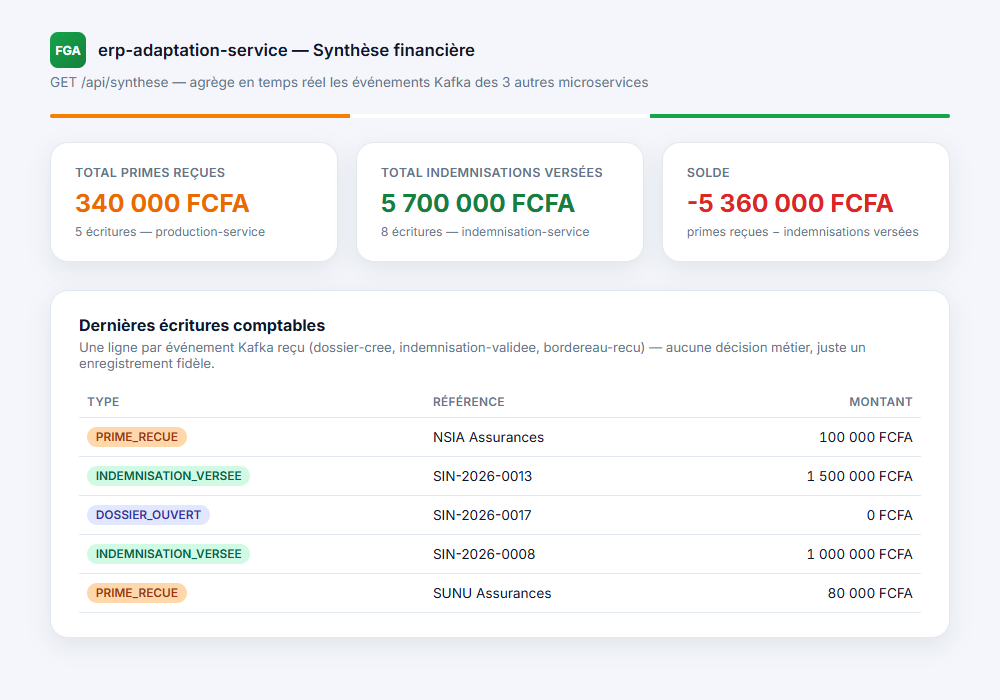

# Mini-FGA

Projet d'entraînement simulant l'architecture microservices d'un Fonds de
Garantie Automobile : indemnisation des victimes d'un côté, collecte des
contributions des compagnies d'assurance de l'autre, le tout agrégé dans
une synthèse financière de type ERP. Objectif : mettre en pratique une
architecture hexagonale, la communication asynchrone entre services via
Kafka, et une authentification JWT partagée entre plusieurs backends.

## Aperçu

| Connexion | Accueil (dossiers) |
|---|---|
|  |  |

| Erreur de connexion | Création réussie |
|---|---|
|  |  |

`erp-adaptation-service` n'a pas d'écran dédié (c'est une API pure) - la
capture ci-dessous est une page de synthèse construite à partir de sa
vraie réponse `GET /api/synthese`, pour illustrer ce qu'il agrège :



## Architecture

Deux chaînes métier indépendantes, réconciliées par un agrégateur financier :

```
                              ┌─ Kafka: dossier-cree ───────────┐
dossier-frontend (Angular)    │                                 ▼
   │                          │                     erp-adaptation-service (8084)
   ├─► sinistre-service (8081)┤                     "intégration ERP/SAGE" :
   │    crée les dossiers,    │                     écoute les 3 topics,
   │    émet le JWT           ├─ Kafka: indemnisation-validee ─►  enregistre une écriture
   │                          │                     comptable par événement,
   ├─► indemnisation-service ─┘                     expose une synthèse
   │    (8082), valide                               (primes / indemnisations / solde)
   │    les indemnisations                          ▲
   │                                                 │
   └─► recouvrement-service (8000)      production-service (8083) ─ Kafka: bordereau-recu
        suit le recouvrement            reçoit les bordereaux de primes des assureurs,
        après indemnisation             calcule la contribution FGA (2%)
```

- **Chaîne sinistre** (visible dans le front) : `sinistre-service` crée un
  dossier → `indemnisation-service` le valide → `recouvrement-service`
  suit le recouvrement. Chaque étape déclenche la suivante via un
  événement Kafka, jamais un appel HTTP direct.
- **Chaîne primes** (backend uniquement, pas encore d'écran dédié) :
  `production-service` reçoit un bordereau de primes d'une compagnie
  d'assurance et calcule la contribution FGA (2 %).
- **`erp-adaptation-service`** ne prend aucune décision métier : il
  écoute les 3 événements (`dossier-cree`, `indemnisation-validee`,
  `bordereau-recu`) et se contente d'enregistrer une écriture comptable
  par événement reçu, exposant une synthèse consolidée. Il doit démarrer
  en dernier puisqu'il ne fait qu'écouter.

**Authentification** : `sinistre-service` est le seul à exposer un
endpoint de connexion et à émettre les tokens JWT ; `indemnisation-service`
et `recouvrement-service` se contentent de les vérifier avec un secret
partagé, sans jamais s'appeler entre eux. `production-service` et
`erp-adaptation-service` ne sont pas (encore) intégrés à cette
authentification ni au front-end : ce sont des microservices backend
purs, consommés uniquement via Kafka et leur propre API REST.

## Les 6 projets

| Dossier | Rôle | Stack |
|---|---|---|
| [`sinistre-service/`](sinistre-service) | Création et consultation des dossiers de sinistre, émission du JWT | Java 17, Spring Boot, Spring Security, PostgreSQL, Kafka |
| [`indemnisation-service/`](indemnisation-service) | Traitement et validation des indemnisations | Java 17, Spring Boot, Spring Security, PostgreSQL, Kafka |
| [`recouvrement-service/`](recouvrement-service) | Suivi du recouvrement après indemnisation | Python 3.12, FastAPI, SQLAlchemy, Kafka |
| [`production-service/`](production-service) | Réception des bordereaux de primes, calcul de la contribution FGA (2%) | Java 17, Spring Boot, PostgreSQL, Kafka |
| [`erp-adaptation-service/`](erp-adaptation-service) | Agrégation financière (écritures comptables + synthèse), simule une intégration ERP/SAGE | Java 17, Spring Boot, PostgreSQL, Kafka |
| [`dossier-frontend/`](dossier-frontend) | Interface Angular (connexion, création, suivi des dossiers) | Angular 17, TypeScript, RxJS |

Chaque dossier a son propre `README.md` avec le détail de sa structure
interne et les instructions pour le lancer isolément.

## Lancer le projet complet

1. **Infrastructure** (4 PostgreSQL + Kafka), un `docker compose up -d`
   dans chacun de ces dossiers :
   ```bash
   sinistre-service/ indemnisation-service/ production-service/ erp-adaptation-service/
   ```

2. **Les 4 backends**, chacun dans son propre dossier :
   ```bash
   cd sinistre-service        && mvn spring-boot:run   # port 8081
   cd indemnisation-service   && mvn spring-boot:run   # port 8082
   cd recouvrement-service    && uvicorn main:app --port 8000
   cd production-service      && mvn spring-boot:run   # port 8083
   cd erp-adaptation-service  && mvn spring-boot:run   # port 8084 - à lancer en dernier
   ```

3. **Le front-end** :
   ```bash
   cd dossier-frontend
   npm install
   ng serve
   ```
   → http://localhost:4300 — connexion de démo : `admin` / `admin123`.

   Le front-end ne couvre aujourd'hui que la chaîne sinistre (sinistre /
   indemnisation / recouvrement) ; `production-service` et
   `erp-adaptation-service` se pilotent pour l'instant via leur API REST
   directement (voir leurs `README.md` respectifs).

## Points d'architecture démontrés

- Architecture hexagonale (ports/adapters) sur les 4 services Java
- Communication interservices découplée via événements Kafka plutôt que
  des appels HTTP directs, y compris un agrégateur (`erp-adaptation-service`)
  qui consomme 3 topics différents sans jamais appeler les services sources
- Authentification JWT partagée entre 3 services indépendants (un seul
  émet le token, les autres le vérifient sans jamais s'appeler)
- Un même système applicatif en 2 langages (Java/Spring et Python/FastAPI)
  exposant chacun le même contrat de sécurité
- Deux flux métier indépendants (sinistres et primes) réconciliés dans une
  synthèse financière commune, sans couplage direct entre eux

## Marge d'évolution

Ce projet est un travail en cours, pas un produit fini. Prochaines étapes
envisagées :

- **Relier `production-service` et `erp-adaptation-service` au front-end
  Angular.** Ils tournent et se testent aujourd'hui uniquement via leur
  API REST (curl / `.http`) - il resterait à ajouter des écrans dédiés
  (réception de bordereaux, tableau de synthèse financière) dans
  `dossier-frontend` pour les rendre utilisables comme la chaîne sinistre.
- **Remplacer le compte de démonstration par une vraie base
  utilisateurs.** L'authentification repose aujourd'hui sur des
  identifiants codés en dur (voir `dossier-frontend/README.md`).
- **Ajouter la modification et la suppression** de dossier, de bordereau
  et d'écriture comptable - le projet ne couvre pour l'instant que la
  consultation et la création.
