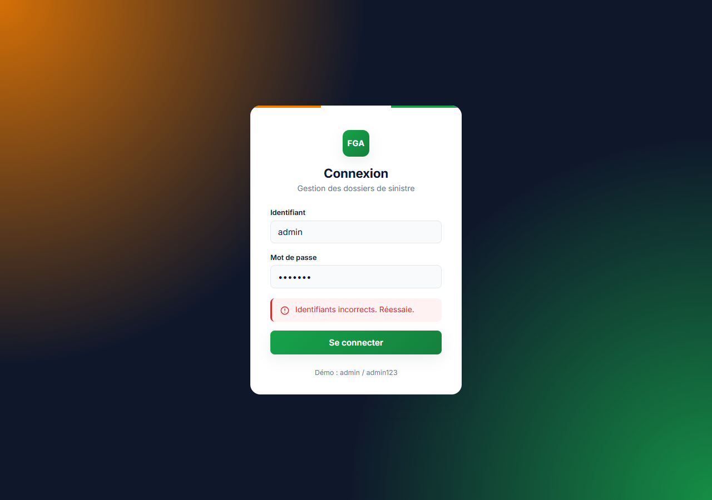
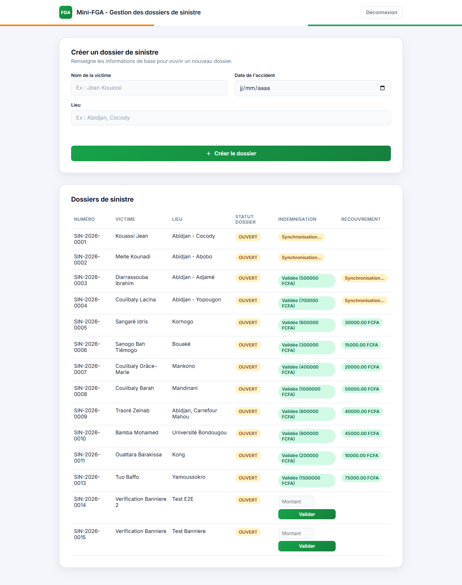
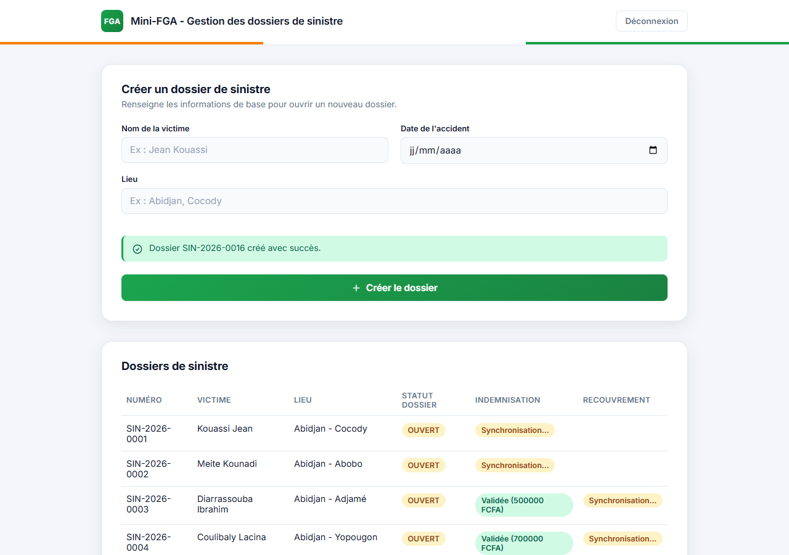

# Mini-FGA — dossier-frontend

Interface Angular du projet d'entraînement **Mini-FGA** (Fonds de Garantie
Automobile). Elle permet de créer et suivre des dossiers de sinistre, en
s'appuyant sur 3 microservices indépendants.

## Architecture

```
dossier-frontend (Angular, port 4300)
        │
        ├── POST /api/auth/login  ─────────────►  sinistre-service      (Java/Spring, 8081)
        ├── GET/POST /api/dossiers ───────────►  sinistre-service      (Java/Spring, 8081)
        │
        ├── GET/PUT /api/indemnisations ──────►  indemnisation-service (Java/Spring, 8082)
        │
        └── GET /api/recouvrements ───────────►  recouvrement-service  (Python/FastAPI, 8000)
```

Les 3 backends communiquent aussi entre eux de façon asynchrone via **Kafka**
(sinistre → indemnisation → recouvrement), indépendamment du front.

## Prérequis

- Node.js + npm
- Java 17 + Maven (pour sinistre-service et indemnisation-service)
- Python 3.12 + venv (pour recouvrement-service)
- Docker (PostgreSQL x2 + Kafka), voir le `docker-compose.yml` de chaque
  microservice backend

## Lancer le projet complet

1. **Infrastructure** (une fois, depuis sinistre-service et indemnisation-service) :
   ```bash
   docker compose up -d
   ```

2. **Les 3 backends**, chacun dans son propre dossier :
   ```bash
   cd sinistre-service        && mvn spring-boot:run   # port 8081
   cd indemnisation-service   && mvn spring-boot:run   # port 8082
   cd recouvrement-service    && uvicorn main:app --port 8000
   ```

3. **Le front-end** :
   ```bash
   npm install
   ng serve
   ```
   → http://localhost:4300

## Authentification

L'accès à l'application est protégé par une connexion. `sinistre-service`
est le seul des 3 backends à exposer un endpoint de connexion
(`POST /api/auth/login`) ; il émet un token JWT (HS256) que
`indemnisation-service` et `recouvrement-service` vérifient ensuite avec le
même secret partagé, sans jamais s'appeler entre eux.

**Compte de démonstration** (aucune base utilisateurs pour l'instant) :

```
Identifiant  : admin
Mot de passe : admin123
```

Le token est stocké côté front en `sessionStorage` et automatiquement
attaché (`Authorization: Bearer <token>`) à chaque appel HTTP sortant par
un intercepteur (`src/app/interceptors/auth.interceptor.ts`). Une réponse
401 d'un des 3 backends déconnecte et renvoie vers `/login`.

⚠️ Secret et identifiants codés en dur : convient pour un projet
d'entraînement, pas pour de la production.

## Design

- Police **Inter**, palette définie par variables CSS dans `src/styles.css`.
- Couleurs principales inspirées du drapeau ivoirien (orange / blanc / vert),
  clin d'œil à l'identité FGA : vert comme couleur d'action principale et de
  statut "validé", orange comme couleur d'accent et de statut
  "attention / synchronisation", visibles sur le ruban tricolore de l'en-tête
  et de la page de connexion.
- Messages (succès / erreur / attention) affichés via un composant de
  bannière réutilisable (`app-banniere`), plutôt que du texte brut.

## Captures d'écran

| Connexion | Erreur de connexion |
|---|---|
|  |  |

| Accueil (dossiers) | Création réussie |
|---|---|
|  |  |

## Fonctionnalités

- Connexion / déconnexion
- Création d'un dossier de sinistre
- Liste des dossiers avec, pour chacun : statut, indemnisation (à valider en
  ligne) et recouvrement, agrégés en direct depuis les 3 microservices
- Pas de modification ni de suppression de dossier pour l'instant (hors
  périmètre actuel)

## Structure du code

```
src/app/
├── components/
│   ├── banniere/        → bannière de message réutilisable (succès/erreur/attention)
│   ├── login/            → page de connexion
│   ├── dossier-form/     → formulaire de création
│   └── dossier-list/     → tableau des dossiers (+ indemnisation/recouvrement)
├── pages/dossiers-page/  → page principale (form + liste), protégée par le guard
├── services/             → un service HTTP par microservice + AuthService
├── interceptors/         → ajout automatique du token JWT
├── guards/               → authGuard (bloque l'accès si non connecté)
└── models/               → interfaces TypeScript des DTOs
```
